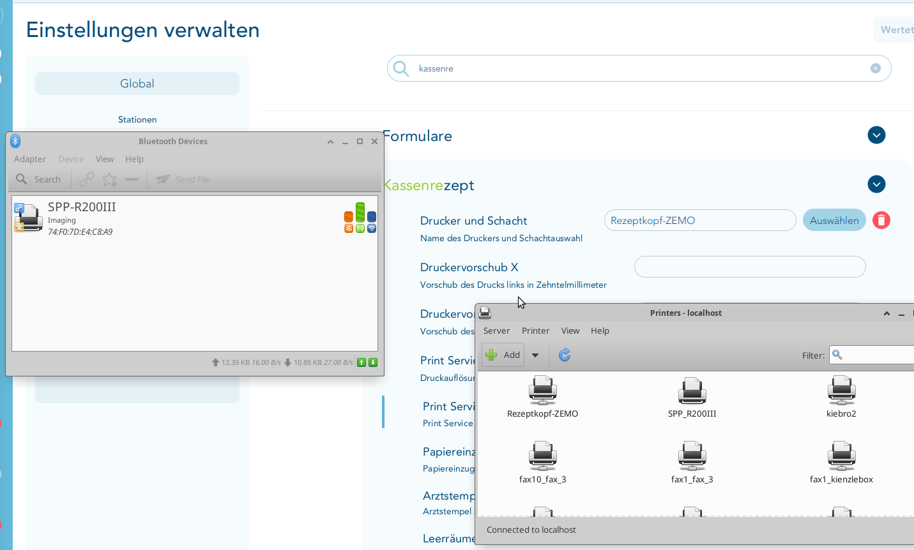

# Rezeptkopf-ZEMO

## Zweck

Der Installer richtet **immer zwei virtuelle Linux-Drucker gleichzeitig** ein:

- `Rezeptkopf-ZEMO` verarbeitet wie bisher eine vollständige Kassenrezept- oder Grüne-Rezept-Seite mit der bewährten Crop-Geometrie.
- `Formularkopf-ZEMO` verarbeitet den in T2med mit **`Strg` + `E`** erzeugten Formularkopf aus einer A4-Seite.

Beide Wege optimieren den Ausschnitt für 203 dpi und senden das Ergebnis direkt per Bluetooth-RFCOMM an einen **BIXOLON SPP-R200III**.

> **Wichtig:** Nicht gleichzeitig über beide Warteschlangen drucken. Beide Dienste verwenden dasselbe RFCOMM-Gerät `/dev/rfcomm0` und besitzen bewusst keine zusätzliche Synchronisierung.

Die Zielmedien sind [**ZEMO VML-GK Etiketten, Produktnummer 2189**](https://zemoshop.de/Zemo-VML-GK-Etiketten-fuer-mobiles-Arztbuero-60-Etiketten-Rolle/2189): 50 mm Medienbreite im Drucker, 82 mm Etikettenlänge in Förderrichtung. Eine Rolle enthält 60 Etiketten.


## Verwendung in T2med

Den Installer auf dem Rechner ausführen, der den mobilen Drucker verwenden soll, beispielsweise auf dem **Hausbesuchs-Laptop**. Danach stehen beide Drucker zur Verfügung.

Für `Formularkopf-ZEMO` in T2med mit **`Strg` + `E`** den Formularkopf erzeugen und an diese Queue ausgeben. Dort gibt es ausdrücklich **keine Auswahl zwischen Grünem Rezept und normalem/Kassenrezept**.

`Rezeptkopf-ZEMO` wird wie bisher in der lokalen T2med-Druckerzuordnung für **Kassenrezept und/oder Grünes Rezept** hinterlegt. Danach wird das jeweilige vollständige Rezept wie gewohnt gedruckt; der Dienst übernimmt unverändert den alten 50-x-82-mm-Crop. Beim Grünen Rezept werden Kasse bzw. Krankenkasse, BSNR und LANR nicht auf das Etikett gedruckt.

Die folgende Druckerzuordnung betrifft ausschließlich `Rezeptkopf-ZEMO`:



## Konfiguration und Geometrie

| Parameter | Wert |
|---|---:|
| Virtuelle Drucker | `Rezeptkopf-ZEMO`, `Formularkopf-ZEMO` |
| Bluetooth-MAC | wird bei der Installation abgefragt |
| RFCOMM-Kanal | `1` |
| RFCOMM-Gerät | `/dev/rfcomm0` |
| Etikettenformat | 50 × 82 mm |
| Vollseiten-Renderauflösung | 609 dpi |
| Physische Druckauflösung | 203 dpi |
| Echte Druckbreite | 384 dots ≈ 48 mm |
| Zielhöhe | 655 dots ≈ 82 mm |
| Schwellenwert | `188` |
| Vorschub | `FF (0x0C)` bis zur nächsten Labelposition |
| Debug-Dateien | aus |

Die queue-spezifische Verarbeitung ist:

| Queue / Dienstmodus | Eingabe | Crop | Crop-Ursprung | Rotation |
|---|---|---:|---:|---:|
| `Formularkopf-ZEMO` / `formularkopf` | A4-Formularkopf aus `Strg` + `E` | 82 × 50 mm | links `26.6 pt`, oben `16.5 pt` | `270°` (konfigurierbar: `90`/`270`) |
| `Rezeptkopf-ZEMO` / `rezept` | vollständige alte Rezeptseite | 50 × 82 mm | links `165.4961 pt`, oben `348.0000 pt` | 180° |

Der Formularkopf-Crop ist ein fester, um die gemessene Inhaltsbox zentrierter Testwert (etwa 9,4 mm von links und 5,8 mm von oben); es findet keine automatische Inhalts- oder Bounding-Box-Erkennung statt. Die Rezeptkoordinaten beziehen sich unverändert auf die vom virtuellen **Generic PostScript Printer** erzeugte Letter-Seite mit 612 × 792 PostScript-Punkten.

## Installation

Unter Ubuntu den Installer herunterladen und ausführen:

```bash
chmod +x install_rezeptkopf_zemo.sh
sudo ./install_rezeptkopf_zemo.sh
```

Der Installer installiert alle benötigten Ubuntu-Pakete (`bluez`, `cups`, `cups-client`, `cups-filters`, `ghostscript`, `python3`, `python3-pil`), richtet den automatischen Bluetooth-RFCOMM-Reconnect ein und installiert denselben Raster-/Crop-Helfer als zwei Dienste. Außerdem legt er beide CUPS-Queues bei jeder Installation kontrolliert neu an:

| CUPS-Queue | Socket | Dienst | Seitengröße | Auflösung |
|---|---|---|---:|---:|
| `Rezeptkopf-ZEMO` | `socket://127.0.0.1:9101` | `rezeptkopf-zemo.service` (`rezept`) | A6 | 600 dpi |
| `Formularkopf-ZEMO` | `socket://127.0.0.1:9102` | `formularkopf-zemo.service` (`formularkopf`) | A4 | 600 dpi |

Beide Generic-PostScript-Queues sind nicht freigegeben. Der gemeinsame Helfer liegt unter `/usr/local/sbin/rezeptkopf-zemo.py`; beide Dienste verwenden `/dev/rfcomm0`.

Der Installer fragt nur nach der Bluetooth-MAC des SPP-R200III. Eingaben mit Kleinbuchstaben oder Bindestrichen werden automatisch normalisiert; bei einem leeren oder ungültigen Wert fragt der Installer erneut.

Der BIXOLON-CUPS-Treiber ist für diese finale Lösung **nicht erforderlich**. Der physische SPP-R200III wird direkt per ESC/POS-Raster über `/dev/rfcomm0` angesteuert.

### Bluetooth

Der SPP-R200III kann mit mehreren Geräten gekoppelt bleiben. Für den Druck darf aber nicht gleichzeitig ein anderes Gerät eine aktive Bluetooth-SPP-Verbindung zum Drucker halten. Insbesondere bei Tests mit einem Mac dessen Bluetooth-Verbindung zum SPP-R200III trennen bzw. Bluetooth dort vorübergehend ausschalten.

Die abgefragte MAC des eingesetzten SPP-R200III eingeben. Optional kann bereits beim Start ein Vorschlagswert gesetzt werden, der anschließend mit **Enter** übernommen werden kann:

```bash
sudo BT_MAC=AA:BB:CC:DD:EE:FF ./install_rezeptkopf_zemo.sh
```

Der getestete RFCOMM-Kanal ist `1`.

Falls der Drucker noch nicht unter Linux gekoppelt ist und das automatische Pairing fehlschlägt, einmal manuell koppeln. PIN ist je nach Konfiguration typischerweise `0000`:

```bash
bluetoothctl
power on
agent on
default-agent
scan on
pair AA:BB:CC:DD:EE:FF
trust AA:BB:CC:DD:EE:FF
scan off
quit
```

Danach den Installer erneut starten.

## Druckerkonfiguration am SPP-R200III

Der Drucker muss im **normalen Bluetooth-SPP-Modus** laufen. Im Self-Test war die funktionierende Konfiguration `STOBa`, Bluetooth Connection Mode 2 und Serial Port Service aktiv.

### Label Mode ein- und ausschalten

Der SPP-R200III verwendet dieselbe Tastenfolge zum Umschalten zwischen **Label Mode** und **Receipt Mode**:

1. Drucker einschalten.
2. Papierfachdeckel öffnen.
3. Die Taste **FEED** (Papiervorschub) länger als zwei Sekunden gedrückt halten.
4. Nach dem Signalton das Etikettenpapier einlegen bzw. korrekt ausrichten und den Deckel schließen.

Ist der Drucker zuvor im Receipt Mode, wird dadurch der Label Mode eingeschaltet. Zum Ausschalten des Label Modes und zur Rückkehr in den Receipt Mode dieselben vier Schritte erneut ausführen.

Für ZEMO 2189:

1. ZEMO-2189-Rolle einlegen.
2. **Label Mode einschalten.**
3. Gap-/Label-Kalibrierung durchführen.
4. Danach übernimmt der Druckdienst am Ende jedes Etiketts mit `FF (0x0C)` den Vorschub bis zur nächsten Labelposition.

Der Form Feed war im finalen Test korrekt; es wird kein zusätzlicher fixer Millimeter-Vorschub mehr verwendet.

## T2med

Die generische Formularkopf-Ausgabe wird in T2med mit **`Strg` + `E`** aufgerufen und an **`Formularkopf-ZEMO`** gedruckt. Dabei wird nicht zwischen Grünem Rezept und normalem/Kassenrezept gewählt.

Für den bisherigen Rezeptweg wird auf dem jeweiligen Rechner **`Rezeptkopf-ZEMO`** für **Kassenrezept und/oder Grünes Rezept** ausgewählt. Nur diese Queue erwartet die vollständige Rezeptseite.

Die getestete Einstellung lautet:

```text
Print Service:
Moderner Druck mit Papierformat und Seitenlayout
```

Die Print-Service-Auflösung sollte auf **600 dpi** stehen.

Keinen Druckdialog erzwingen und nicht auf den physischen BIXOLON-Drucker umleiten. T2med sendet die A4-Formularkopf-Ausgabe an `Formularkopf-ZEMO` oder die vollständige alte Rezeptseite an `Rezeptkopf-ZEMO`; der jeweilige lokale Dienst übernimmt Crop, Skalierung, Rotation und Ausgabe.

Die beiden Warteschlangen dürfen nicht gleichzeitig drucken, weil beide Dienste direkt dasselbe RFCOMM-Gerät verwenden.

## Qualitäts-Pipeline

Die gute Lesbarkeit entsteht absichtlich nicht durch direktes 203-dpi-Rastern. Beide Dienste rendern zuerst die vollständige Eingabeseite mit Ghostscript bei 609 dpi in Graustufen und schneiden erst danach mit festen Koordinaten aus.

Pipeline von `Formularkopf-ZEMO`:

```text
T2med Strg+E
  ↓
Generic PostScript / A4-Formularkopf
  ↓
Ghostscript 609 dpi, 8-bit Graustufen
  ↓
fester 82-x-50-mm-Crop NACH dem vollständigen Rendern
  ↓
Autokontrast und Lanczos-Downsampling auf ca. 655 × 400 Punkte
  ↓
leichte Unsharp-Mask
  ↓
90°-Rotation mit vergrößerter Arbeitsfläche (alternativ 270°)
  ↓
symmetrischer Crop von ca. 400 auf 384 echte Druckpunkte
  ↓
Endformat exakt 384 × 655 Punkte
  ↓
Schwellwert 188, kein Dithering
  ↓
ESC/POS GS v 0 Raster und FF (0x0C)
```

Unveränderte Pipeline von `Rezeptkopf-ZEMO`:

```text
T2med / vollständige Kassenrezept- oder Grüne-Rezept-Seite
  ↓
Ghostscript 609 dpi, 8-bit Graustufen
  ↓
unveränderter 50-x-82-mm-Crop NACH dem vollständigen Rendern
  ↓
Autokontrast
  ↓
Lanczos-Downsampling auf ca. 400 × 655 Punkte bei 203 dpi
  ↓
leichte Unsharp-Mask
  ↓
symmetrischer Crop auf 384 echte Druckpunkte
  ↓
180° Rotation
  ↓
Endformat exakt 384 × 655 Punkte
  ↓
Schwellwert 188, kein Dithering
  ↓
ESC/POS GS v 0 Raster
  ↓
FF (0x0C) bis zur nächsten Labelposition
  ↓
SPP-R200III
```

Der wichtige Punkt ist **Crop nach dem vollständigen Rendern**. Ein `PageOffset` direkt in Ghostscript war nicht zuverlässig, weil der eingehende T2med/Generic-PostScript-Job selbst `setpagedevice` setzt.

## Menschliche Orientierung des Etiketts

Bei späteren Korrekturen immer das **fertig gedruckte Etikett so betrachten, wie ein Mensch den Text von links nach rechts liest**. Diese menschlichen Achsen sind wegen der Einzugsrichtung und der Rotation nicht identisch mit den internen Crop-Achsen.

Für den Formularkopf kann die Drehrichtung nach einem physischen Test ohne Codeänderung zwischen `90` und `270` umgestellt werden:

```text
FORM_ROTATION=270
```

Andere Werte weist der Dienst zurück. Für den alten Rezeptmodus gilt weiterhin unverändert:

```text
RECIPE_CROP_LEFT_PT = 165.4961
RECIPE_CROP_TOP_PT  = 348.0000
```

Diese Werte nicht anhand der Namen „LEFT“ und „TOP“ intuitiv verändern. Bei einer späteren Feinjustierung am besten erst ein Testetikett messen und die Änderung bewusst auf die menschliche Leserichtung beziehen.

## Dienste und Diagnose

Status der Bluetooth-Verbindung:

```bash
rfcomm
systemctl status zemo-rfcomm.service
```

Status der virtuellen Druckdienste:

```bash
systemctl status rezeptkopf-zemo.service
systemctl status formularkopf-zemo.service
```

Live-Log während eines Drucks:

```bash
sudo journalctl -u rezeptkopf-zemo -f
sudo journalctl -u formularkopf-zemo -f
```

CUPS:

```bash
lpstat -v Rezeptkopf-ZEMO
lpstat -p Rezeptkopf-ZEMO -l
lpstat -v Formularkopf-ZEMO
lpstat -p Formularkopf-ZEMO -l
```

Wenn `/dev/rfcomm0` nicht vorhanden ist, zunächst prüfen, ob der Drucker eingeschaltet ist und kein anderes Gerät eine aktive SPP-Verbindung hält:

```bash
ls -l /dev/rfcomm0
bluetoothctl info AA:BB:CC:DD:EE:FF
```

Der `zemo-rfcomm.service` versucht die Verbindung automatisch erneut aufzubauen.

## Datenschutz / Debugging

Der Produktionsmodus speichert im Hilfsdienst **keine Patientendaten dauerhaft**. Temporäre Dateien liegen nur während der Verarbeitung in einem privaten temporären Verzeichnis und werden danach gelöscht.

Während der Entwicklung wurde CUPS zeitweise mit `PreserveJobFiles=Yes` betrieben. Falls das auf dem Zielsystem noch aktiv ist, danach wieder deaktivieren:

```bash
sudo cupsctl PreserveJobFiles=No
```

Debugbilder können für eine gezielte Fehlersuche über `KEEP_DEBUG=1` in `/etc/rezeptkopf-zemo.conf` aktiviert werden. Dabei werden jedoch Rezeptdaten unter `/tmp/` abgelegt; deshalb im Praxisbetrieb wieder auf `KEEP_DEBUG=0` setzen und beide Dienste neu starten:

```bash
sudo systemctl restart rezeptkopf-zemo.service
sudo systemctl restart formularkopf-zemo.service
```

## Konfigurationsdatei

Die zentrale Konfiguration liegt hier:

```text
/etc/rezeptkopf-zemo.conf
```

Die gemeinsame Crop-Konfiguration enthält keinen Eingabemodus. Die Ports sind eindeutig benannt; `INPUT_MODE` und `ZEMO_PORT` werden von der jeweiligen systemd-Dienstdefinition gesetzt.

```text
ZEMO_HOST=127.0.0.1
RECIPE_PORT=9101
FORM_PORT=9102

MEDIA_W_MM=50.0
MEDIA_H_MM=82.0

FORM_CROP_W_MM=82.0
FORM_CROP_H_MM=50.0
FORM_CROP_LEFT_PT=26.6
FORM_CROP_TOP_PT=16.5
FORM_ROTATION=270

RECIPE_CROP_W_MM=50.0
RECIPE_CROP_H_MM=82.0
RECIPE_CROP_LEFT_PT=165.4961
RECIPE_CROP_TOP_PT=348.0000

RENDER_DPI=609
TARGET_DPI=203
PRINT_DOTS=384
THRESHOLD=188
KEEP_DEBUG=0
```

`rezeptkopf-zemo.service` setzt `INPUT_MODE=rezept` und Port 9101, `formularkopf-zemo.service` setzt `INPUT_MODE=formularkopf` und Port 9102. Der Helfer akzeptiert keine anderen Modi. `FORM_ROTATION` wird nur vom Formularkopf-Dienst ausgewertet und darf dort nur `90` oder `270` sein; ein ungültiger Wert hindert den unabhängigen Rezeptdienst nicht am Start.

## Deinstallation

```bash
sudo lpadmin -x Rezeptkopf-ZEMO 2>/dev/null || true
sudo lpadmin -x Formularkopf-ZEMO 2>/dev/null || true

sudo systemctl disable --now \
  rezeptkopf-zemo.service \
  formularkopf-zemo.service \
  zemo-rfcomm.service

sudo rm -f \
  /etc/systemd/system/rezeptkopf-zemo.service \
  /etc/systemd/system/formularkopf-zemo.service \
  /etc/systemd/system/zemo-rfcomm.service \
  /usr/local/sbin/rezeptkopf-zemo.py \
  /etc/rezeptkopf-zemo.conf

sudo systemctl daemon-reload
```

Die vom Installer installierten allgemeinen Ubuntu-Pakete werden absichtlich nicht automatisch entfernt, weil CUPS, BlueZ, Ghostscript und Pillow auch von anderen Programmen genutzt werden können.
