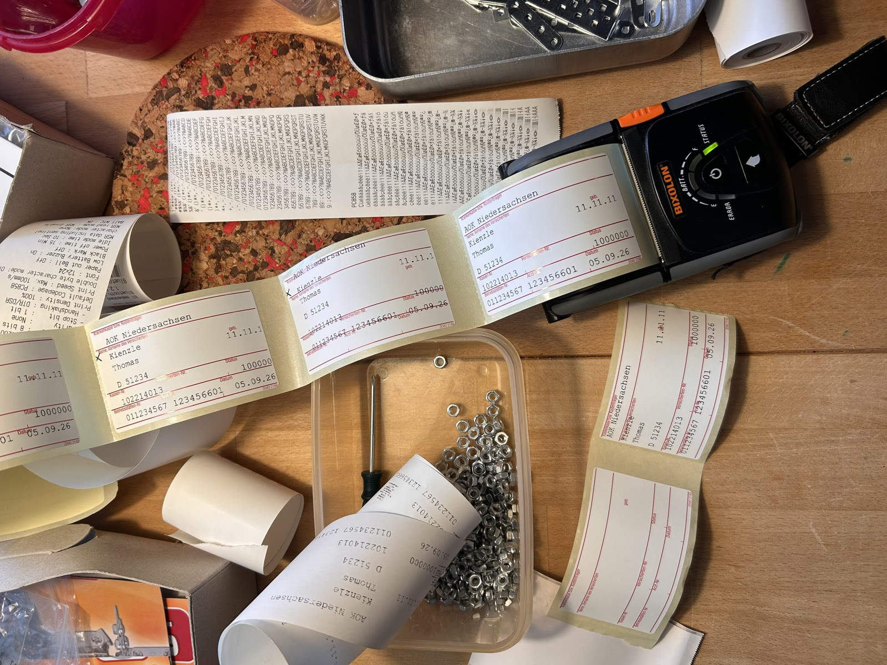

# Rezeptkopf-ZEMO

## Zweck

`Rezeptkopf-ZEMO` ist ein virtueller Linux-Drucker für T2med. T2med druckt ein normales vollständiges Kassenrezept oder Grünes Rezept an einen hochwertigen PostScript-Drucker. Der lokale Dienst rendert zuerst die vollständige Seite hochauflösend, schneidet danach den vorgesehenen Rezeptkopf aus, optimiert die Darstellung für 203 dpi und sendet das Ergebnis direkt per Bluetooth-RFCOMM an einen **BIXOLON SPP-R200III**.

Die Zielmedien sind **ZEMO 2189**: 50 mm Medienbreite im Drucker, 82 mm Etikettenlänge in Förderrichtung.



## Verwendung in T2med

Den Installer auf dem Rechner ausführen, der den mobilen Drucker verwenden soll, beispielsweise auf dem **Hausbesuchs-Laptop**. Anschließend in der lokalen T2med-Druckerzuordnung auf genau diesem Rechner den Drucker **`Rezeptkopf-ZEMO`** für **Kassenrezept und/oder Grünes Rezept** hinterlegen.

Danach einfach das gewünschte Kassenrezept oder Grüne Rezept wie gewohnt in T2med ausdrucken. Es ist kein Export und kein besonderer Druckablauf erforderlich: T2med sendet die vollständige Rezeptseite an `Rezeptkopf-ZEMO`; der Dienst druckt daraus nur den Rezeptkopf auf das ZEMO-Etikett.

**Wichtig beim Grünen Rezept:** Kasse bzw. Krankenkasse, BSNR und LANR werden nicht auf das Etikett gedruckt.

## Final bestätigte Konfiguration

| Parameter | Wert |
|---|---:|
| Virtueller Drucker | `Rezeptkopf-ZEMO` |
| Bluetooth-MAC | wird bei der Installation abgefragt |
| RFCOMM-Kanal | `1` |
| RFCOMM-Gerät | `/dev/rfcomm0` |
| Etikettenformat | 50 × 82 mm |
| Vollseiten-Renderauflösung | 609 dpi |
| Physische Druckauflösung | 203 dpi |
| Echte Druckbreite | 384 dots ≈ 48 mm |
| Zielhöhe | 655 dots ≈ 82 mm |
| Crop links | `165.4961 pt` |
| Crop oben | `348.0000 pt` |
| Schwellenwert | `188` |
| Endrotation | 180° |
| Vorschub | `FF (0x0C)` bis zur nächsten Labelposition |
| Debug-Dateien | aus |

Diese Crop-Koordinaten beziehen sich auf die vom virtuellen **Generic PostScript Printer** erzeugte Letter-Seite mit 612 × 792 PostScript-Punkten. Sie sind der im Test final bestätigte Stand.

## Installation

Unter Ubuntu den Installer herunterladen und ausführen:

```bash
chmod +x install_rezeptkopf_zemo.sh
sudo ./install_rezeptkopf_zemo.sh
```

Der Installer installiert alle benötigten Ubuntu-Pakete (`bluez`, `cups`, `cups-client`, `cups-filters`, `ghostscript`, `python3`, `python3-pil`), richtet den automatischen Bluetooth-RFCOMM-Reconnect ein, installiert den lokalen Raster-/Crop-Dienst und legt den CUPS-Drucker `Rezeptkopf-ZEMO` an.

Zu Beginn fragt der Installer nach der Bluetooth-MAC des SPP-R200III. Eingaben mit Kleinbuchstaben oder Bindestrichen werden automatisch normalisiert; bei einem leeren oder ungültigen Wert fragt der Installer erneut.

Der BIXOLON-CUPS-Treiber ist für diese finale Lösung **nicht erforderlich**. Der physische SPP-R200III wird direkt per ESC/POS-Raster über `/dev/rfcomm0` angesteuert.

### Bluetooth

Der SPP-R200III kann mit mehreren Geräten gekoppelt bleiben. Für den Druck darf aber nicht gleichzeitig ein anderes Gerät eine aktive Bluetooth-SPP-Verbindung zum Drucker halten. Insbesondere bei Tests mit einem Mac dessen Bluetooth-Verbindung zum SPP-R200III trennen bzw. Bluetooth dort vorübergehend ausschalten.

Die abgefragte MAC des eingesetzten SPP-R200III eingeben. Optional kann bereits beim Start ein Vorschlagswert gesetzt werden, der anschließend mit **Enter** übernommen werden kann:

```bash
sudo BT_MAC=AA:BB:CC:DD:EE:FF ./install_rezeptkopf_zemo.sh
```

Der getestete RFCOMM-Kanal ist `1`.

Falls der Drucker noch nicht unter Linux gekoppelt ist und das automatische Pairing fehlschlägt, einmal manuell koppeln. PIN ist je nach Konfiguration typischerweise `0000`:

```bash
bluetoothctl
power on
agent on
default-agent
scan on
pair AA:BB:CC:DD:EE:FF
trust AA:BB:CC:DD:EE:FF
scan off
quit
```

Danach den Installer erneut starten.

## Druckerkonfiguration am SPP-R200III

Der Drucker muss im **normalen Bluetooth-SPP-Modus** laufen. Im Self-Test war die funktionierende Konfiguration `STOBa`, Bluetooth Connection Mode 2 und Serial Port Service aktiv.

### Label Mode ein- und ausschalten

Der SPP-R200III verwendet dieselbe Tastenfolge zum Umschalten zwischen **Label Mode** und **Receipt Mode**:

1. Drucker einschalten.
2. Papierfachdeckel öffnen.
3. Die Taste **FEED** (Papiervorschub) länger als zwei Sekunden gedrückt halten.
4. Nach dem Signalton das Etikettenpapier einlegen bzw. korrekt ausrichten und den Deckel schließen.

Ist der Drucker zuvor im Receipt Mode, wird dadurch der Label Mode eingeschaltet. Zum Ausschalten des Label Modes und zur Rückkehr in den Receipt Mode dieselben vier Schritte erneut ausführen.

Für ZEMO 2189:

1. ZEMO-2189-Rolle einlegen.
2. **Label Mode einschalten.**
3. Gap-/Label-Kalibrierung durchführen.
4. Danach übernimmt der Druckdienst am Ende jedes Etiketts mit `FF (0x0C)` den Vorschub bis zur nächsten Labelposition.

Der Form Feed war im finalen Test korrekt; es wird kein zusätzlicher fixer Millimeter-Vorschub mehr verwendet.

## T2med

In T2med auf dem jeweiligen Rechner den Drucker **`Rezeptkopf-ZEMO`** für **Kassenrezept und/oder Grünes Rezept** auswählen.

Die getestete Einstellung lautet:

```text
Print Service:
Moderner Druck mit Papierformat und Seitenlayout
```

Die Print-Service-Auflösung sollte auf **600 dpi** stehen.

Keinen Druckdialog erzwingen und nicht auf den physischen BIXOLON-Drucker umleiten. T2med soll die vollständige Rezeptseite an `Rezeptkopf-ZEMO` senden; der lokale Dienst übernimmt Crop, Skalierung, Rotation und Ausgabe.

## Qualitäts-Pipeline

Die gute Lesbarkeit entsteht absichtlich nicht durch direktes 203-dpi-Rastern. Die Verarbeitung ist:

```text
T2med
  ↓
Generic PostScript / vollständige Rezeptseite
  ↓
Ghostscript 609 dpi, 8-bit Graustufen
  ↓
Crop NACH dem vollständigen Rendern
  ↓
50 × 82 mm
  ↓
Autokontrast
  ↓
Lanczos-Downsampling auf 203 dpi
  ↓
leichte Unsharp-Mask
  ↓
symmetrischer Crop auf 384 echte Druckpunkte
  ↓
180° Rotation
  ↓
Schwellwert 188, kein Dithering
  ↓
ESC/POS GS v 0 Raster
  ↓
FF (0x0C) bis zur nächsten Labelposition
  ↓
SPP-R200III
```

Der wichtige Punkt ist **Crop nach dem vollständigen Rendern**. Ein `PageOffset` direkt in Ghostscript war nicht zuverlässig, weil der eingehende T2med/Generic-PostScript-Job selbst `setpagedevice` setzt.

## Menschliche Orientierung des Etiketts

Bei späteren Korrekturen immer das **fertig gedruckte Etikett so betrachten, wie ein Mensch den Text von links nach rechts liest**. Diese menschlichen Achsen sind wegen der Einzugsrichtung und der finalen 180°-Rotation nicht identisch mit den internen Crop-Achsen.

Im final bestätigten Stand gilt:

```text
CROP_LEFT_PT = 165.4961
CROP_TOP_PT  = 348.0000
```

Diese Werte nicht anhand der Namen „LEFT“ und „TOP“ intuitiv verändern. Bei einer späteren Feinjustierung am besten erst ein Testetikett messen und die Änderung bewusst auf die menschliche Leserichtung beziehen.

## Dienste und Diagnose

Status der Bluetooth-Verbindung:

```bash
rfcomm
systemctl status zemo-rfcomm.service
```

Status des virtuellen Druckdienstes:

```bash
systemctl status rezeptkopf-zemo.service
```

Live-Log während eines Drucks:

```bash
sudo journalctl -u rezeptkopf-zemo -f
```

CUPS:

```bash
lpstat -v Rezeptkopf-ZEMO
lpstat -p Rezeptkopf-ZEMO -l
```

Wenn `/dev/rfcomm0` nicht vorhanden ist, zunächst prüfen, ob der Drucker eingeschaltet ist und kein anderes Gerät eine aktive SPP-Verbindung hält:

```bash
ls -l /dev/rfcomm0
bluetoothctl info AA:BB:CC:DD:EE:FF
```

Der `zemo-rfcomm.service` versucht die Verbindung automatisch erneut aufzubauen.

## Datenschutz / Debugging

Der Produktionsmodus speichert im Hilfsdienst **keine Patientendaten dauerhaft**. Temporäre Dateien liegen nur während der Verarbeitung in einem privaten temporären Verzeichnis und werden danach gelöscht.

Während der Entwicklung wurde CUPS zeitweise mit `PreserveJobFiles=Yes` betrieben. Falls das auf dem Zielsystem noch aktiv ist, danach wieder deaktivieren:

```bash
sudo cupsctl PreserveJobFiles=No
```

Debugbilder können für eine gezielte Fehlersuche über `KEEP_DEBUG=1` in `/etc/rezeptkopf-zemo.conf` aktiviert werden. Dabei werden jedoch Rezeptdaten unter `/tmp/` abgelegt; deshalb im Praxisbetrieb wieder auf `KEEP_DEBUG=0` setzen und den Dienst neu starten:

```bash
sudo systemctl restart rezeptkopf-zemo.service
```

## Konfigurationsdatei

Die zentrale Konfiguration liegt hier:

```text
/etc/rezeptkopf-zemo.conf
```

Die finale Kalibrierung:

```text
CROP_LEFT_PT=165.4961
CROP_TOP_PT=348.0000
RENDER_DPI=609
TARGET_DPI=203
PRINT_DOTS=384
THRESHOLD=188
KEEP_DEBUG=0
```

## Deinstallation

```bash
sudo lpadmin -x Rezeptkopf-ZEMO 2>/dev/null || true

sudo systemctl disable --now rezeptkopf-zemo.service zemo-rfcomm.service

sudo rm -f \
  /etc/systemd/system/rezeptkopf-zemo.service \
  /etc/systemd/system/zemo-rfcomm.service \
  /usr/local/sbin/rezeptkopf-zemo.py \
  /etc/rezeptkopf-zemo.conf

sudo systemctl daemon-reload
```

Die vom Installer installierten allgemeinen Ubuntu-Pakete werden absichtlich nicht automatisch entfernt, weil CUPS, BlueZ, Ghostscript und Pillow auch von anderen Programmen genutzt werden können.
